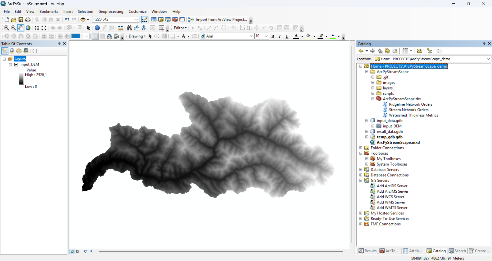

# ArcPyStreamScape

Набор скриптов в среде ArcGIS Desktop для структурно-гидрографического анализа речных систем.

A set of ArcGIS Desktop scripts for river system structure analysis.

## Описание и инструкция по использованию

Набор инструментов ArcPyStreamScape для ArcGIS Desktop содержит следующие инструменты:

* Stream Network Orders – инструмент автоматической оцифровки и порядковой классификации речной сети по цифровым моделям рельефа (ЦМР) на основе вариантов т.н. «функции инициации»;
* Ridgeline Network Orders – инструмент автоматической оцифровки и порядковой классификации сети водоразделов по ЦМР на основе авторского метода;
* Watershed Thickness Metrics – инструмент автоматического определения набора мер «толщины» речного бассейна.

Для того, чтобы работать с инструментами, клонируйте репозиторий или загрузите набор инструментов в виде ZIP-архива. Для загрузки инструментов единым архивом на странице репозитория на GitHub нажмите зелёную кнопку `Code` и в раскрывшемся меню выберите опцию `Download ZIP`, как показано ниже.

Когда архив будет загружен, распакуйте его в свою рабочую директорию. Для работы набора инструментов нужен файл `*.tbx` и папка `scripts`, причём они обязательно должны находиться в одной и той же директории.

Перед началом работы мы рекомендуем сделать следующее:
* Создать новый проект ArcGIS (*.mxd)
* Создать для этого проекта новую базу геоданных (*.gdb)
* Назначить созданную базу геоданных в качестве базы по умолчанию для проекта

### Подготовка к работе

Поскольку набор инструментов всё ещё находится в режиме разработки, перед его использованием мы рекомендуем выполнить несколько подготовительных операций:

1. Создайте пустую папку для хранения материалов вашего проекта.
2. Создайте новый документ ArcMap (*.mxd) и расположите его в папке, созданной на шаге 1.
3. В папке проекта создайте новую базу геоданных (*.gdb).

    

4. Назначьте созданную базу геоданных базой по умолчанию для вашего документа карты. Для этого в панели Каталога нажмите на созданную базу геоданных правой кнопкой мыши и в контекстном меню выберите опцию `Make Default Geodatabase`. Эта база будет использоваться для хранения временных файлов, создаваемых в ходе работы инструментов.

    

5. (*опционально*) Переместите набор инструментов ArcPyStreamScape и исходные данные для расчёта в папку вашего проекта. Этот шаг не обязателен и не влияет на работоспособность инструментов, однако позволит упростить вам работу с ними. 

На снимке экрана ниже показан вид проекта ArcGIS Desktop после выполнения всех предварительных шагов, включая опциональные. Обратите внимание на содержимое панели Каталога.

### Работа с инструментом Stream Network Orders

### Работа с инструментом Ridgeline Network Orders

### Работа с инструментом Watershed Thickness Metrics

## Overview and instruction manual

ArcPyStreamScape toolkit for ArcGIS Desktop

* Stream Network Orders is a tool for automatic digitization and order classification of the river network using digital elevation model (DEM) based on so-called  “initiation functions”;
* Ridgeline Network Orders is a tool for automatic digitization and order classification of a watershed network using DEM based on the author’s method;
* Watershed Thickness Metrics is a tool for automatically determining a set of characteristics of the “thickness” of a river basin.

To work with the tools, clone the repository or download the toolset as a ZIP archive. To download the tools as a single archive, on the repository page on GitHub, click the green `Code` button and select the `Download ZIP` option from the drop-down menu, as shown below.

Once the archive is downloaded, unzip it into your working directory. The toolbox requires a `*.tbx` file and a `scripts` folder, and they must be located in the same directory.

Before you start, we recommend to do the following:
* Create a new ArcGIS project (*.mxd)
* Create a new geodatabase (*.gdb) for the project
* Set the created geodatabase as the default geodatabase for the project

### Preparing for work

Since the toolbox is still in development, we recommend you to perform a few preparatory steps before using it.